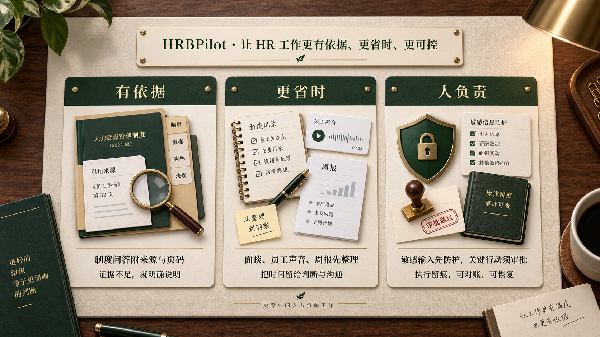
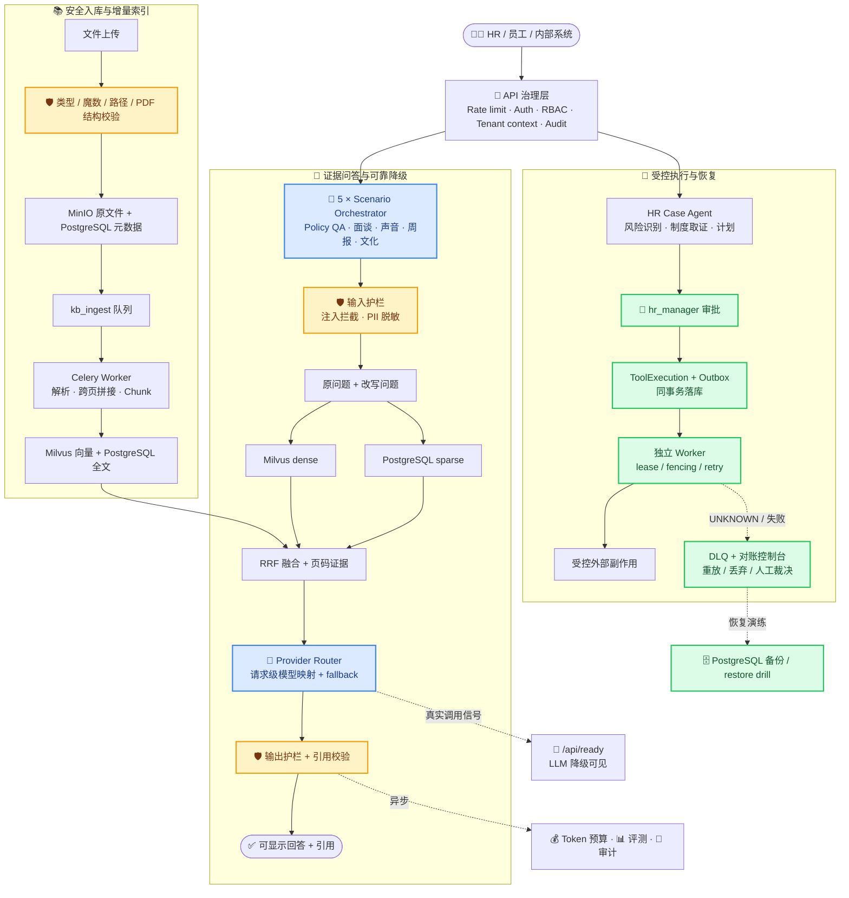

<a id="top"></a>

<div align="center">

# 🧭 HRBPilot

**企业 HR 领域智能体 · 一套后端覆盖 5 大高频 HR 场景**

内置 Hybrid RAG · 合规护栏 · 质量评测 · Token 预算管控<br/>
让 AI 在 HR 场景里 **用得起、防得住**

<p>
  <a href="./README.md"></a>
  <a href="./README_en.md"></a>
</p>

<p>
  <a href="https://github.com/kayon0209/hrbpilot/actions/workflows/ci.yml"></a>
  <a href="./LICENSE"></a>
  
  
</p>

<p>
  
  
  
  
  
  
  
  
  
</p>

<p>
  
</p>

<sub>证据优先，不替人做决定；把高频整理交给系统，把判断、审批与责任留给人。</sub>

</div>

---

## 📖 目录

- [为什么是 HRBPilot](#-为什么是-hrbpilot而不是又一个-hr-问答-bot)
- [产品特色](#-产品特色)
- [覆盖的 HR 场景](#-覆盖的-hr-场景)
- [HR Case Agent：受控执行与通知](#-hr-case-agent受控执行与通知)
- [外部 AI Agent 接入（MCP + OAuth）](#-外部-ai-agent-接入mcp--oauth)
- [系统架构](#-系统架构)
- [评测结果](#-评测结果真实-llm-跑通)
- [快速开始](#-快速开始)
- [知识库与索引流程](#-知识库与索引流程)
- [技术栈与目录结构](#-技术栈与目录结构)
- [测试](#-测试)
- [已知限制](#-已知限制)

---

## 🎯 为什么是 HRBPilot，而不是「又一个 HR 问答 Bot」

HR 场景真正的痛点是**风险与成本**，不是「能不能答出来」。一句不合规的答复、一次超预算的调用，都比「答得不够聪明」代价更高。

|  |  |  |
| :-- | :-- | :-- |
| 🛡️ **护栏是一等公民** | 💰 **成本可核算** | 🔍 **RAG 不作假** |
| 原始输入**先过护栏再进任何模型**：注入检测在查询改写之前完成，PII 先脱敏、改写结果再复检；观测日志只留长度与哈希，**不落原文**。注入攻击在 golden 集上 **5/5 全拦，误拦率 0.0** | 每次调用都计入租户月度 token 预算（默认 1000 万），**75% 预警 / 90% 严重告警**，成本随时可查 | 原问题与改写问题双路 dense + sparse 召回，再经 RRF 融合；**无 mock 回退**。外部服务不可用时抛出明确的基础设施错误，绝不假装检索成功 |

> [!NOTE]
> 所有回答强制携带引用（citation）。检索不到证据时走 `no_evidence_fallback` 明确拒答，而不是编造答案。



---

## ✨ 产品特色

HRBPilot 不是把一个通用聊天模型包装成 HR 工具，而是围绕 HR 的实际工作方式设置了三条底线：

- **问制度，要有依据。** 制度问答从当前租户可用的企业知识库中检索；答案带来源，证据不足就明确说明，而不是编造结论。
- **做日常工作，减少重复整理。** 面谈纪要、员工声音、周报和文化内容先由系统完成结构化整理与生成，HR 把时间留给判断和沟通。
- **涉及行动，始终由人负责。** 建单、指派、状态更新等写操作需要人工审批；执行过程、通知和结果都保留可查看的记录。

---

## 💼 覆盖的 HR 场景

每个场景都是独立的 `orchestrator` + `config` + `prompts` + `schemas`，互不干扰、可单独演进。

| 场景 | 模块 | 做什么 |
| :--- | :--- | :--- |
| 📋 **制度问答** | `policy_qa` | 基于知识库的政策咨询，含查询改写等预处理与引用校验等后处理 |
| 🗣️ **面谈纪要** | `interview_digest` | 绩效 / 离职 / 入职面谈记录的结构化智能摘要 |
| 🎧 **语音洞察** | `voice_insight` | 语音、会议内容的洞察提炼 |
| 📅 **周报生成** | `weekly_report` | 自动汇总生成 HR 周报 |
| 🎨 **文化内容** | `culture_content` | 企业文化相关内容生成 |

---

## 🤖 HR Case Agent：受控执行与通知

除五个分析场景外，系统提供一个边界明确的 HR Case Agent：员工或 HR 提出问题后，系统依次完成风险识别、制度取证与计划生成；涉及写操作时，必须经过人工审批，随后才由独立 Worker 执行并留下审计轨迹。

| 能力 | 行为与边界 |
| :--- | :--- |
| **受控写操作** | `create_hr_case`、`assign_case_owner`、`update_case_status` 与 `create_work_task` 必须满足审批已通过、未过期、参数哈希一致且未消费。`/execute` 只原子受理并返回 `202`，不会在 HTTP 请求中直接产生外部副作用。 |
| **可靠派发** | ToolExecution、精确 ExecutionGrant 与 `tool.dispatch` Outbox 同一事务落库。Worker 使用 lease/fencing 与稳定 `request_id` 执行，确定性失败可重试或进入 DLQ；结果不确定时标记为 `UNKNOWN`，禁止盲目重试。 |
| **全链路查看** | `GET /api/v1/hr-cases/{id}/runs/{run_id}` 可返回计划、工具执行、审批与事件轨迹。状态机只允许 `NEW → TRIAGED → EVIDENCE_READY → PLAN_READY → AWAITING_APPROVAL → EXECUTING → RESOLVED/FAILED` 的合法迁移。 |
| **审批角色单一来源** | 审批只能由 `hr_manager` 决定。平台 admin 与 RBAC 能力矩阵对齐——不持有任何 HR 业务能力（读案件、审批均拒绝），角色×能力×对象范围三层同源，防止「路由进不来、服务层却能批」的语义漂移。 |
| **策略问答保护** | Policy QA 只在当前租户、用户、会话与场景范围内加载有限上下文，多轮历史**预算紧张时优先保留最新一轮**；检索证据作为**不可信数据降权注入**（user-role 边界块，永不进入 system 消息）。请求按场景/风险/成本选择不可变的模型配置，**每个 provider 用自己的模型名**做请求级故障回退，绝不修改全局模型选择。流式请求也须先完成输出护栏和无证据回退，才返回可显示内容。 |
| **站内通知** | `GET /api/notifications` 和已读接口只返回当前收件人的通知元数据；跨收件人 ID 返回 404，案件正文仍须通过案件 ACL 访问。 |

运行受控写操作时，必须有独立的 Outbox Worker。Docker Compose 已配置该进程；本地或其他部署方式请启动：

```bash
python -m app.outbox.worker
```

可用 `python -m app.outbox.worker --once --max-messages 100` 做受限的排障/运维轮询。接口示例、DLQ 重放与 `UNKNOWN` 对账流程见 [运维手册](./docs/upgrade/HR_CASE_AGENT_RUNBOOK.md)，设计取舍见 [ADR](./docs/upgrade/ADR-0001-single-bounded-agent.md)。

---

## 🔌 外部 AI Agent 接入（MCP + OAuth）

在 WorkBuddy、Codex、Claude Code 等**你自己日常使用的 AI Agent** 里，通过标准 MCP
实时调用 HRBPilot。HRBPilot 侧负责认证、租户与权限判定、最小化返回、审批与审计。

**接入方式**：远程 MCP（Streamable HTTP）+ OAuth 2.1 + PKCE。客户端首次调用未带凭据时
会收到 `401` 与 RFC 9728 挑战，据此自动完成发现、授权与令牌交换 —— 用户只需在浏览器里
登录并点一次同意。

**能力边界**（三点最要紧）：

| 边界 | 说明 |
| --- | --- |
| **没有匿名业务数据** | `/.well-known/*` 与授权端点匿名可读（协议要求），但**任何真实 HR 业务数据都需要身份**。未认证的读调用拿不到内容。 |
| **权限是三个维度的交集** | 有效权限 = 用户角色能力 ∩ 凭据 scope ∩ 客户端授权上限。任一项不足都会拒绝，且拒绝原因在日志里可分辨是"人不够"还是"这个客户端不够"。 |
| **写入只创建审批** | 所有写工具**只创建 `ApprovalRequest`**，不直接改业务数据。工具返回的是"已提交审批 + 审批编号"，不是"已完成"。 |

**授权范围**（对外契约，改名等于破坏已有客户端的授权）：

| Scope | 能力 |
| --- | --- |
| `hrb:policy:read` | 搜索制度、读取制度来源与引用证据 |
| `hrb:case:read` | 搜索与读取有权查看的案件 |
| `hrb:case:propose` | 为案件提交待审批的建议动作 |
| `hrb:approval:read` | 查询有权查看的审批状态 |
| `hrb:profile:read` | 读取当前身份与可用能力的摘要 |

**部署与运维**：

- 管理员部署与故障排查：`docs/ops/2026-09-14-external-mcp-deployment-and-runbook.md`
- 架构决策与偏差记录：`docs/upgrade/ADR-0002-mcp-resource-server-and-authorization-server.md`
- 威胁模型：`docs/security/mcp-threat-model.md`
- WorkBuddy 连接器包：`connectors/workbuddy/`
- 端到端验收：`python scripts/verify_oauth_end_to_end.py --database-url <库>`

WorkBuddy 连接器包已随本仓库提供，但**有三项需要人工替换或确认**（占位域名、图标、
服务端开关），见该目录的 `README.md`。

**当前状态**：协议验收 10 条全过、端到端 58/58；但**尚未用真实客户端验证过** ——
兼容矩阵如实标注了每一格的"未实测"，见
`docs/ops/2026-09-14-client-compatibility-matrix.md`。

---

## 🏗 系统架构



**基础设施层**：PostgreSQL（Alembic 迁移 + 行级隔离 RLS）· Redis Broker / Backpressure · Celery（kb_ingest / scenario）· MinIO · Milvus

<details>
<summary>📐 查看静态架构图（SVG）</summary>


</details>

---

## 📊 评测结果（真实 LLM 跑通）

2026-08-28 在 **250 样本 golden 集**（5 场景各 50 条，含 5 条注入拒答用例）上以真实 LLM（Gitee AI `qwen3.8-flash`）完整跑通，对应代码提交 `0a585ca`。样本构成：`policy_qa` 与 `interview_digest` 共 **100 条人工撰写**；`voice_insight`、`weekly_report`、`culture_content` 共 **150 条由确定性模板扩增**，两类不可混作同一数据质量口径。后续安全、检索与执行能力的变更，需要在新基线上另行复测，不能倒推为这次运行已经覆盖。

可宣称产物：`evaluation/results/golden_eval_20260828T215711Z.json`（`for_external_claims: true`，250/250 全量、0 错误；`repair_history` 完整披露了 2 次瞬态错误修复与护栏修复后的 3 条部分重跑，其余 247 条继承自基础运行）。

<table>
<tr>
<td width="50%" valign="top">

**护栏与成本**

| 维度 | 结果 |
| :--- | :--- |
| 护栏 overall | **1.0** |
| 注入拦截 recall | **1.0** （5/5 全拦） |
| 误拦率 false_positive | **0.0** |
| Token 总消耗 | 554,387（99.9% 真实计费） |
| 预算占用 | 10M 月度预算的 **5.54%** |
| 折算容量 | 约 **18 次 / 租户 / 月** |

</td>
<td width="50%" valign="top">

**各场景质量**

| 场景 | 关键词命中 | 引用覆盖率 |
| :--- | :---: | :---: |
| `policy_qa` | 0.908 | 0.9 |
| `interview_digest` | 0.79 | **1.0** |
| `voice_insight` | 0.91 | **1.0** |
| `weekly_report` | 0.536 | **1.0** |
| `culture_content` | 0.104 | **1.0** |

</td>
</tr>
</table>

> [!TIP]
> 完整运行产物见 `app/evaluation/` 与 `evaluation/results/`。指标由离线 `run_golden_eval.py` 真实跑出，非估算。

---

## 🚀 快速开始

### 方式一：Docker Compose（推荐，含完整 Hybrid RAG）

RAG 依赖四个外部服务：PostgreSQL、Milvus、MinIO、Redis。一键拉起：

```bash
cp env.docker.example env.docker    # ① 复制环境变量模板
#  ② 填写 env.docker：JWT_SECRET（≥32 位）、EMBEDDING_API_KEY、
#     LLM_API_KEY、MINIO_ACCESS_KEY、MINIO_SECRET_KEY
docker compose up -d --build        # ③ 后台启动完整环境
docker compose ps                   # ④ 确认服务状态
curl -fsS http://127.0.0.1:8001/api/ready  # ⑤ 确认 API 已就绪（或显示可降级状态）
```

> [!IMPORTANT]
> 生产模式（`APP_ENV=production`）会**拒绝启动**在默认 JWT 密钥上，请务必填写至少 32 位的 `JWT_SECRET`。

<details>
<summary>🔧 启动顺序与自动化行为</summary>

`docker compose` 已用 healthcheck 编排依赖顺序：

1. PostgreSQL 就绪
2. 应用执行 `alembic upgrade head` 迁移
3. Milvus / MinIO / Redis 就绪
4. FastAPI（uvicorn）启动
5. Celery Worker 消费 kb_ingest 与 scenario 队列；Outbox Worker 处理已审批的受控写操作

启动时自动确保 Milvus collection（维度须与 `EMBEDDING_DIMENSION` 一致）与 MinIO bucket 存在。PostgreSQL 应用账号为**非超级用户**，确保行级隔离 RLS 不会被连接账号绕过。

</details>

### 方式二：本地开发（轻量，不含向量检索）

```bash
python -m venv .venv && source .venv/bin/activate   # Windows: .venv\Scripts\activate
pip install -e ".[dev]"
cp .env.example .env                                # 按需填写
uvicorn app.main:app --reload --port 8000
```

打开 **http://localhost:8000/docs** 查看交互式 API 文档。

---

## 📚 知识库与索引流程

**支持的文档格式**

| | 格式 |
| :--- | :--- |
| ✅ 支持 | `txt` · `pdf` · `docx` |
| ❌ 明确不支持 | `doc` · `xls` · `ppt`（上传会被拒绝，不会假装已入库） |

<details>
<summary>⚙️ 索引与查询链路详解</summary>

**索引（写入）**

```
上传文件 → 安全校验（类型 / 魔数 / 路径 / PDF 结构）
        → MinIO → documents (PostgreSQL, status=uploaded)
        → 原子领取并投递 Redis/Celery 任务
        → 解析（含跨页拼接、DOCX 表格顺序与 OCR 页码诊断）→ 切分 → jieba 分词 → embedding
        → document_chunks (PostgreSQL) + Milvus upsert
        → 标记 indexed
```

重建失败会**保留上一版可用向量**，新旧版本按 chunk id 精确补偿清理。

**确定性 Chunk ID 与增量 Embedding**

- chunk id 由 `(tenant, kb, document, chunk_index)` 确定性派生，同一文档同一位置重建后 **ID 不变**，PostgreSQL + Milvus 的写入天然幂等；
- 重建时按 `content_sha256` 比对新旧 chunk：**内容未变的块直接复用旧向量，不重新 embedding**（也要求 embedding model 一致）；只有真正变化的文本才重新计费；
- 日志如实记录 `embeddings_reused / embeddings_computed`，重建成本可审计。

**查询（读取）**

原问题与实际发生变化的改写问题分别执行 PostgreSQL 关键词召回（`plainto_tsquery('simple', jieba_query)`）和 Milvus 稠密召回（`tenant_id` + `kb_id` 标量过滤），再以 RRF 融合。这样改写只会增加召回候选，不会替换、丢失原始意图；页码证据随结果保留给 LLM 引用。

Policy QA 只接受当前租户下**已启用**且 `scenario_id=policy_qa` 的真实知识库。

</details>

---

## 🧰 技术栈与目录结构

FastAPI · Uvicorn · Pydantic v2 · SQLAlchemy (async) + AsyncPG · Alembic · Redis · Celery · MinIO · Milvus · jieba · structlog · PyYAML

<details>
<summary>📂 展开目录结构</summary>

```
hrbpilot/
├── app/
│   ├── access/        # 中间件链 + 路由（health / auth / 各场景 / eval / kb / settings）
│   ├── config/        # 配置（pydantic-settings）
│   ├── data/          # database / models / repositories / alembic migrations
│   ├── evaluation/    # 评测指标聚合 + golden dataset
│   ├── guardrails/    # 合规 / 输入 / 输出护栏 + 限流
│   ├── rag/           # ingestion / knowledge_base / llm / retrieval / pipeline
│   ├── scenarios/     # 5 个 HR 场景（各自 orchestrator + config + prompts + schemas）
│   └── shared/        # 日志 / 错误 / 审计 / 缓存 / token_budget / 优雅退出
├── evaluation/        # 离线 golden 评测脚本与运行结果
├── interview_samples/ # 面谈记录样本（.txt）
├── kb_docs/           # HR 知识库原始文档（PDF / DOCX / TXT）
├── tests/             # pytest（单元 + 集成 + 安全回归）
└── alembic.ini · Dockerfile · docker-compose.yml · pyproject.toml · .env.example
```

</details>

---

## ✅ 测试

```bash
pytest                              # 全量
pytest -m "not integration"         # 跳过需要真实 PostgreSQL / Milvus 的集成测试
```

CI 在每次 push 与 PR 上执行后端（`ruff check` · `ruff format --check` · `mypy` · `pytest`）与前端（`pnpm lint` · `tsc -b` · `vitest run`）双 job 检查。

### 生产基线（可复现冻结）

每个里程碑用 `scripts/freeze_production_baseline.py` 冻结一份**不可手改**的验证基线：绑定 commit SHA、依赖锁哈希与冻结时间，记录后端（pytest / ruff / mypy）与前端（lint / tsc / vitest）的实测结果，产物自带内容校验哈希，`--verify` 可检出任何手改。它是某次可复现验证的“收据”，不是永久有效的绿灯；代码、依赖或环境改变后必须重新冻结。

当前冻结基线见 [`docs/production-baseline.json`](./docs/production-baseline.json)。它绑定一次特定提交与当时的依赖、服务可达性；测试中的 skip 全部为环境门控（`HRBP_RUN_*` / `DATABASE_URL`），不存在无人认领的永久 skip。合并代码或依赖变更后，请先运行 `python scripts/freeze_production_baseline.py` 再更新对外结论。

### Web 工作台

前端位于 `web/`，覆盖制度问答、知识库、面谈纪要、员工声音、HR 周报、文化内容、检索评测和模型服务设置。页面只读取真实后端状态，不内置业务 mock 数据。

使用 Docker 启动完整环境：

```bash
docker compose up -d --build
```

启动后访问：

- Web 工作台：`http://localhost:3001`
- FastAPI / OpenAPI：`http://localhost:8001/docs`
- MinIO 控制台：`http://localhost:9001`

登录账号必须通过项目已有的用户初始化流程创建。不要把邮箱、密码、JWT 或供应商 API Key 写入前端源码。Nginx 会将浏览器的 `/api/*` 请求反向代理到 `app:8000`，因此生产镜像不需要持有任何模型密钥。

不使用 Docker 时，可在安装 Node.js 22 与 Corepack 后运行：

```bash
corepack pnpm --dir web install
corepack pnpm --dir web dev
```

开发服务器位于 `http://localhost:5173`，Vite 会把 `/api` 代理到 `http://localhost:8001`。

前端验证命令：

```bash
corepack pnpm --dir web lint
corepack pnpm --dir web test:run
corepack pnpm --dir web build
```

端到端测试只从本地环境变量读取测试账号：

```bash
E2E_EMAIL=your-account E2E_PASSWORD=your-password corepack pnpm --dir web exec playwright test
```

---

## ⚠️ 已知限制

- `weekly_report` 场景的关键词命中（0.536）偏低，主要因周报自由文本难以用关键词衡量，正在优化评测方式。
- `culture_content` 的关键词命中（0.104）低：创意生成类场景与关键词口径不匹配（引用覆盖率仍为 1.0），同样需要更合适的评测方式。
- `policy_qa` 的引用覆盖率为 0.9（端到端 REAL-LLM 口径）；结构化引用门禁（source_recall 0.9333 / source_precision 1.0，OFFLINE-DETERMINISTIC 模式）已在 Phase 2 落地，端到端 REAL-LLM 复测已于 2026-08-28 完成。
- HR Case Agent 的质量门禁目前仍是离线确定性评测，尚未宣称 REAL-LLM 端到端指标。`send_case_notification` 仍没有可验证的外部 Provider；该调用会进入 DLQ，不会伪造投递成功。
- **外部 Agent 接入尚未用真实客户端验证过**：协议验收 10 条全过、端到端 58/58，
  但没有用 WorkBuddy / Codex / Claude Code 的真实客户端跑过。兼容矩阵如实标注了每
  一格的"未实测"与验证方法（`docs/ops/2026-09-14-client-compatibility-matrix.md`）。
- **CIMD（Client ID Metadata Documents）没有端到端验证**：它需要一个公网 HTTPS 文档
  服务器，本地起不出来。而它是 ADR 指定的**主**注册路径 —— 验证程度低于兼容回退路径
  （DCR），补它的优先级更高。
- **外部接入没有独立的指标端点**：告警依赖结构化日志采集，见运维手册 §7 的事件名清单。
- **登录租户固定为 `default`**：多租户部署要接外部 Agent 时，这一条必须先解决。

---

## 📄 License

本项目基于 [MIT License](./LICENSE) 开源。

<div align="right"><a href="#top">⬆ 回到顶部</a></div>
