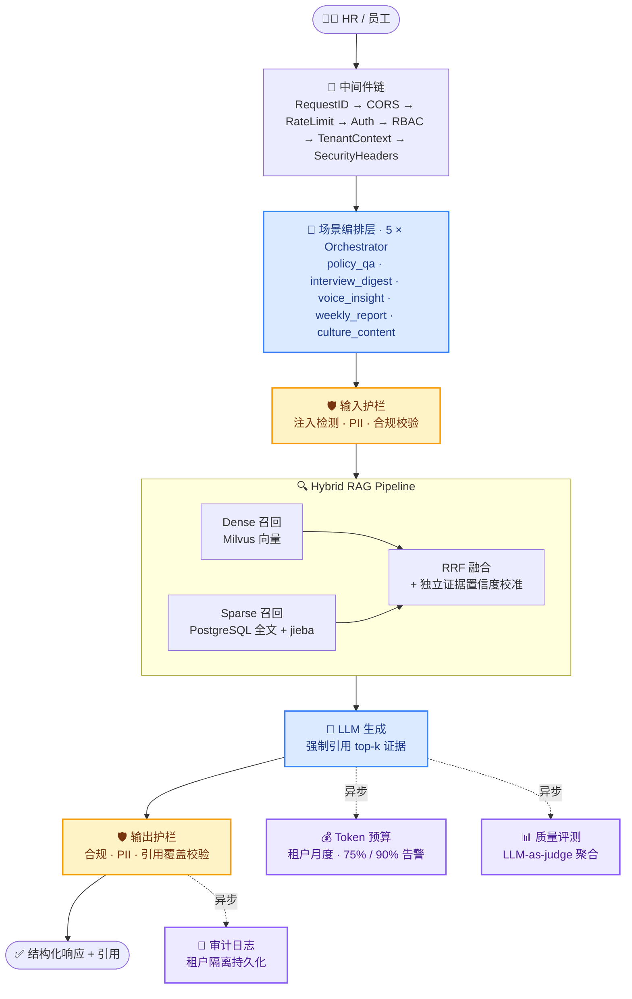
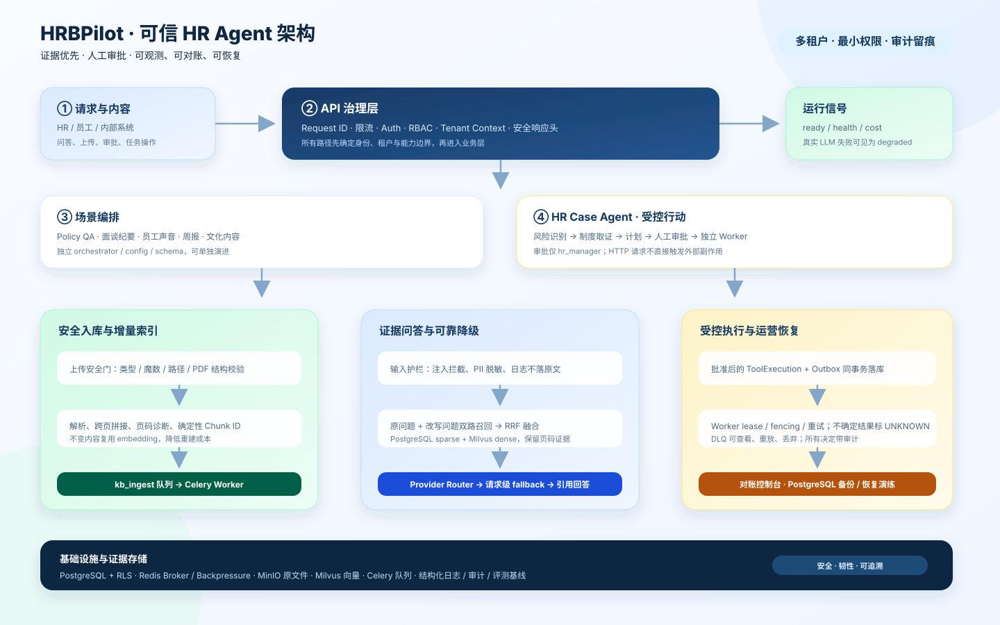

<a id="top"></a>

<div align="center">

# 🧭 HRBPilot

**企业 HR 领域智能体 · 一套后端覆盖 5 大高频 HR 场景**

内置 Hybrid RAG · 合规护栏 · 质量评测 · Token 预算管控<br/>
让 AI 在 HR 场景里 **用得起、防得住**

<p>
  <a href="./README.md"></a>
  <a href="./README_en.md"></a>
</p>

<p>
  <a href="https://github.com/kayon0209/hrbpilot/actions/workflows/ci.yml"></a>
  <a href="./LICENSE"></a>
  
  
</p>

<p>
  
  
  
  
  
  
  
  
  
</p>

</div>

---

## 📖 目录

- [为什么是 HRBPilot](#-为什么是-hrbpilot而不是又一个-hr-问答-bot)
- [覆盖的 HR 场景](#-覆盖的-hr-场景)
- [系统架构](#-系统架构)
- [评测结果](#-评测结果真实-llm-跑通)
- [快速开始](#-快速开始)
- [知识库与索引流程](#-知识库与索引流程)
- [技术栈与目录结构](#-技术栈与目录结构)
- [测试](#-测试)
- [已知限制](#-已知限制)

---

## 🎯 为什么是 HRBPilot，而不是「又一个 HR 问答 Bot」

HR 场景真正的痛点是**风险与成本**，不是「能不能答出来」。一句不合规的答复、一次超预算的调用，都比「答得不够聪明」代价更高。

|  |  |  |
| :-- | :-- | :-- |
| 🛡️ **护栏是一等公民** | 💰 **成本可核算** | 🔍 **RAG 不作假** |
| 输入先过护栏、输出再过护栏，中间还有合规校验与限流。注入攻击在 golden 集上 **5/5 全拦，误拦率 0.0** | 每次调用都计入租户月度 token 预算（默认 1000 万），**75% 预警 / 90% 严重告警**，成本随时可查 | dense + sparse + RRF 融合，**无 mock 回退**。外部服务不可用时抛出明确的基础设施错误，绝不假装检索成功 |

> [!NOTE]
> 所有回答强制携带引用（citation）。检索不到证据时走 `no_evidence_fallback` 明确拒答，而不是编造答案。

---

## 💼 覆盖的 HR 场景

每个场景都是独立的 `orchestrator` + `config` + `prompts` + `schemas`，互不干扰、可单独演进。

| 场景 | 模块 | 做什么 |
| :--- | :--- | :--- |
| 📋 **制度问答** | `policy_qa` | 基于知识库的政策咨询，含查询改写等预处理与引用校验等后处理 |
| 🗣️ **面谈纪要** | `interview_digest` | 绩效 / 离职 / 入职面谈记录的结构化智能摘要 |
| 🎧 **语音洞察** | `voice_insight` | 语音、会议内容的洞察提炼 |
| 📅 **周报生成** | `weekly_report` | 自动汇总生成 HR 周报 |
| 🎨 **文化内容** | `culture_content` | 企业文化相关内容生成 |

---

## 🏗 系统架构



**存储层**：PostgreSQL（Alembic 迁移 + 行级隔离 RLS）· Redis · Celery · MinIO · Milvus

<details>
<summary>📐 查看静态架构图（SVG）</summary>



</details>

---

## 📊 评测结果（真实 LLM 跑通）

2026-07-30 在 **250 样本 golden 集**（5 场景各 50 条，含 5 条注入拒答用例）上以真实 LLM 完整跑通。

<table>
<tr>
<td width="50%" valign="top">

**护栏与成本**

| 维度 | 结果 |
| :--- | :--- |
| 护栏 overall | **1.0** |
| 注入拦截 recall | **1.0** （5/5 全拦） |
| 误拦率 false_positive | **0.0** |
| Token 总消耗 | 225,133（99.78% 真实计费） |
| 预算占用 | 10M 月度预算的 **2.25%** |
| 折算容量 | 约 **44 次 / 租户 / 月** |

</td>
<td width="50%" valign="top">

**各场景质量**

| 场景 | 关键词命中 | 引用覆盖率 |
| :--- | :---: | :---: |
| `policy_qa` | 0.58 | 0.33 |
| `interview_digest` | 0.83 | **1.0** |
| `voice_insight` | 0.89 | **1.0** |
| `weekly_report` | 0.32 | **1.0** |
| `culture_content` | 0.62 | **1.0** |

</td>
</tr>
</table>

> [!TIP]
> 完整运行产物见 `app/evaluation/` 与 `evaluation/results/`。指标由离线 `run_golden_eval.py` 真实跑出，非估算。

---

## 🚀 快速开始

### 方式一：Docker Compose（推荐，含完整 Hybrid RAG）

RAG 依赖四个外部服务：PostgreSQL、Milvus、MinIO、Redis。一键拉起：

```bash
cp env.docker.example env.docker    # ① 复制环境变量模板
#  ② 填写 env.docker：JWT_SECRET（≥32 位）、EMBEDDING_API_KEY、
#     LLM_API_KEY、MINIO_ACCESS_KEY、MINIO_SECRET_KEY
docker compose up --build           # ③ 启动
```

> [!IMPORTANT]
> 生产模式（`APP_ENV=production`）会**拒绝启动**在默认 JWT 密钥上，请务必填写至少 32 位的 `JWT_SECRET`。

<details>
<summary>🔧 启动顺序与自动化行为</summary>

`docker compose` 已用 healthcheck 编排依赖顺序：

1. PostgreSQL 就绪
2. 应用执行 `alembic upgrade head` 迁移
3. Milvus / MinIO / Redis 就绪
4. uvicorn + Celery ingestion worker 启动

启动时自动确保 Milvus collection（维度须与 `EMBEDDING_DIMENSION` 一致）与 MinIO bucket 存在。PostgreSQL 应用账号为**非超级用户**，确保行级隔离 RLS 不会被连接账号绕过。

</details>

### 方式二：本地开发（轻量，不含向量检索）

```bash
python -m venv .venv && source .venv/bin/activate   # Windows: .venv\Scripts\activate
pip install -e ".[dev]"
cp .env.example .env                                # 按需填写
uvicorn app.main:app --reload --port 8000
```

打开 **http://localhost:8000/docs** 查看交互式 API 文档。

---

## 📚 知识库与索引流程

**支持的文档格式**

| | 格式 |
| :--- | :--- |
| ✅ 支持 | `txt` · `pdf` · `docx` |
| ❌ 明确不支持 | `doc` · `xls` · `ppt`（上传会被拒绝，不会假装已入库） |

<details>
<summary>⚙️ 索引与查询链路详解</summary>

**索引（写入）**

```
上传文件 → MinIO → documents (PostgreSQL, status=uploaded)
        → 原子领取并投递 Redis/Celery 任务
        → 解析 → 切分 → jieba 分词 → embedding
        → document_chunks (PostgreSQL) + Milvus upsert
        → 标记 indexed
```

重建失败会**保留上一版可用向量**，新旧版本按 chunk id 精确补偿清理。

**查询（读取）**

PostgreSQL 关键词召回（`plainto_tsquery('simple', jieba_query)`）与 Milvus 稠密召回（`tenant_id` + `kb_id` 标量过滤）**并发执行** → RRF 融合 → 独立证据置信度校准 → top-k → LLM 引用。

Policy QA 只接受当前租户下**已启用**且 `scenario_id=policy_qa` 的真实知识库。

</details>

---

## 🧰 技术栈与目录结构

FastAPI · Uvicorn · Pydantic v2 · SQLAlchemy (async) + AsyncPG · Alembic · Redis · Celery · MinIO · Milvus · jieba · structlog · PyYAML

<details>
<summary>📂 展开目录结构</summary>

```
hrbpilot/
├── app/
│   ├── access/        # 中间件链 + 路由（health / auth / 各场景 / eval / kb / settings）
│   ├── config/        # 配置（pydantic-settings）
│   ├── data/          # database / models / repositories / alembic migrations
│   ├── evaluation/    # 评测指标聚合 + golden dataset
│   ├── guardrails/    # 合规 / 输入 / 输出护栏 + 限流
│   ├── rag/           # ingestion / knowledge_base / llm / retrieval / pipeline
│   ├── scenarios/     # 5 个 HR 场景（各自 orchestrator + config + prompts + schemas）
│   └── shared/        # 日志 / 错误 / 审计 / 缓存 / token_budget / 优雅退出
├── evaluation/        # 离线 golden 评测脚本与运行结果
├── interview_samples/ # 面谈记录样本（.txt）
├── kb_docs/           # HR 知识库原始文档（PDF / DOCX / TXT）
├── tests/             # pytest（单元 + 集成 + 安全回归）
└── alembic.ini · Dockerfile · docker-compose.yml · pyproject.toml · .env.example
```

</details>

---

## ✅ 测试

```bash
pytest                              # 全量
pytest -m "not integration"         # 跳过需要真实 PostgreSQL / Milvus 的集成测试
```

CI 在每次 push 与 PR 上执行 `ruff check` · `ruff format --check` · `mypy` · `pytest`。

---

## ⚠️ 已知限制

- `weekly_report` 场景的关键词命中（0.32）偏低，主要因周报自由文本难以用关键词衡量，正在优化评测方式。
- `policy_qa` 的引用覆盖率（0.33）仍有提升空间，是当前优先改进方向。

---

## 📄 License

本项目基于 [MIT License](./LICENSE) 开源。

<div align="right"><a href="#top">⬆ 回到顶部</a></div>
