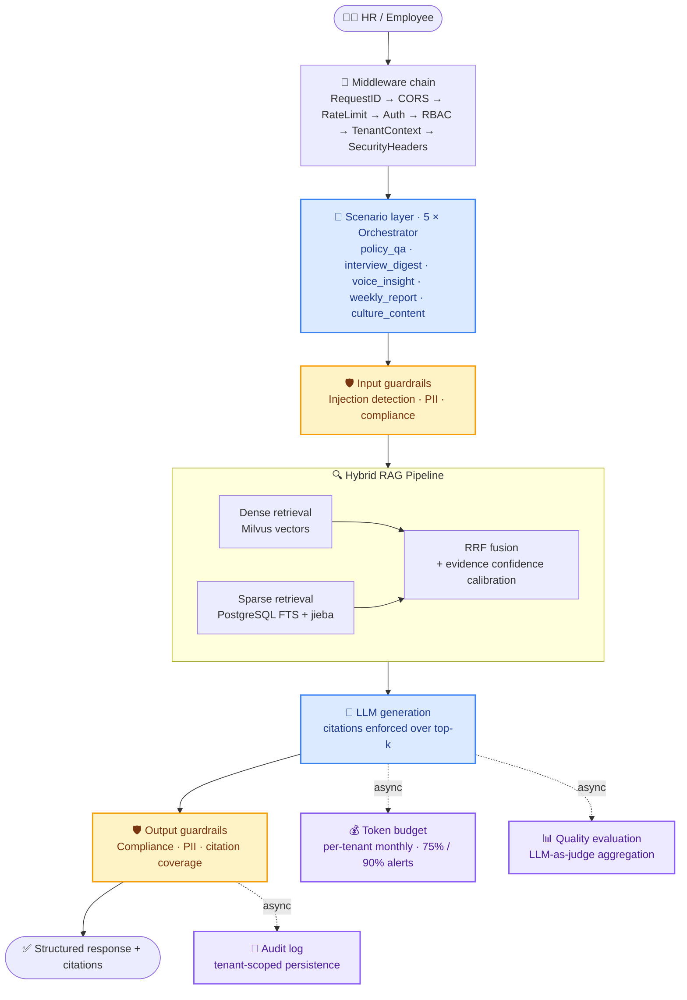

<a id="top"></a>

<div align="center">

# 🧭 HRBPilot

**An enterprise HR agent · One backend covering 5 high-frequency HR scenarios**

Hybrid RAG · Compliance guardrails · Quality evaluation · Token budget governance<br/>
Making AI in HR **affordable and safe to ship**

<p>
  <a href="./README.md"></a>
  <a href="./README_en.md"></a>
</p>

<p>
  <a href="https://github.com/kayon0209/hrbpilot/actions/workflows/ci.yml"></a>
  <a href="./LICENSE"></a>
  
  
</p>

<p>
  
  
  
  
  
  
  
  
  
</p>

</div>

---

## 📖 Table of Contents

- [Why HRBPilot](#-why-hrbpilot-and-not-just-another-hr-qa-bot)
- [HR scenarios covered](#-hr-scenarios-covered)
- [Architecture](#-architecture)
- [Evaluation results](#-evaluation-results-real-llm-run)
- [Quick start](#-quick-start)
- [Knowledge base and indexing](#-knowledge-base-and-indexing)
- [Stack and layout](#-stack-and-project-layout)
- [Testing](#-testing)
- [Known limitations](#-known-limitations)

---

## 🎯 Why HRBPilot, and not just another HR QA bot

The real pain in HR scenarios is **risk and cost**, not whether a model can produce an answer. One non-compliant reply, or one over-budget call, costs far more than an answer that is merely less clever.

|  |  |  |
| :-- | :-- | :-- |
| 🛡️ **Guardrails as a first-class citizen** | 💰 **Cost you can account for** | 🔍 **RAG that never fakes it** |
| Input passes guardrails, output passes them again, with compliance checks and rate limiting in between. On the golden set: **5/5 injections blocked, 0.0 false-positive rate** | Every call counts against a per-tenant monthly token budget (10M by default), with **75% warning / 90% critical alerts** | Dense + sparse retrieval fused via RRF, with **no mock fallback**. If an external service is down it raises an explicit infrastructure error instead of pretending retrieval succeeded |

> [!NOTE]
> Every answer is required to carry citations. When no supporting evidence is retrieved, the pipeline takes the `no_evidence_fallback` path and explicitly declines rather than fabricating an answer.

---

## 💼 HR scenarios covered

Each scenario is an independent `orchestrator` + `config` + `prompts` + `schemas`, so they evolve without interfering with each other.

| Scenario | Module | What it does |
| :--- | :--- | :--- |
| 📋 **Policy Q&A** | `policy_qa` | Knowledge-base-grounded policy consultation, with query rewriting as preprocessing and citation validation as postprocessing |
| 🗣️ **Interview digest** | `interview_digest` | Structured summaries of performance, exit and onboarding interview records |
| 🎧 **Voice insight** | `voice_insight` | Insight extraction from voice and meeting content |
| 📅 **Weekly report** | `weekly_report` | Automated HR weekly report generation |
| 🎨 **Culture content** | `culture_content` | Generation of corporate-culture content |

---

## 🏗 Architecture



**Storage layer:** PostgreSQL (Alembic migrations + row-level security) · Redis · Celery · MinIO · Milvus

<details>
<summary>📐 View the static architecture diagram (SVG)</summary>


</details>

---

## 📊 Evaluation results (real LLM run)

On 2026-07-30 the full pipeline was run against a **250-sample golden set** (50 per scenario, including 5 injection-refusal cases) using a real LLM. Composition: `policy_qa` and `interview_digest` account for **100 hand-written samples**; `voice_insight`, `weekly_report`, and `culture_content` are **150 deterministically parameterized samples** — the two groups must not be presented as a single data-quality figure.

<table>
<tr>
<td width="50%" valign="top">

**Guardrails and cost**

| Metric | Result |
| :--- | :--- |
| Guardrail overall | **1.0** |
| Injection recall | **1.0** (5/5 blocked) |
| False-positive rate | **0.0** |
| Total tokens | 225,133 (99.78% real billing) |
| Budget consumed | **2.25%** of the 10M monthly budget |
| Implied capacity | ~**44 calls / tenant / month** |

</td>
<td width="50%" valign="top">

**Per-scenario quality**

| Scenario | Keyword hit | Citation coverage |
| :--- | :---: | :---: |
| `policy_qa` | 0.58 | 0.33 |
| `interview_digest` | 0.83 | **1.0** |
| `voice_insight` | 0.89 | **1.0** |
| `weekly_report` | 0.32 | **1.0** |
| `culture_content` | 0.62 | **1.0** |

</td>
</tr>
</table>

> [!TIP]
> Full run artifacts live under `app/evaluation/` and `evaluation/results/`. These numbers come from an actual offline `run_golden_eval.py` run, not estimates.

---

## 🚀 Quick start

### Option 1: Docker Compose (recommended, full Hybrid RAG)

RAG depends on four external services: PostgreSQL, Milvus, MinIO and Redis. Bring everything up at once:

```bash
cp env.docker.example env.docker    # 1. copy the env template
#  2. fill in env.docker: JWT_SECRET (>=32 chars), EMBEDDING_API_KEY,
#     LLM_API_KEY, MINIO_ACCESS_KEY, MINIO_SECRET_KEY
docker compose up --build           # 3. start
```

> [!IMPORTANT]
> In production mode (`APP_ENV=production`) the app **refuses to start** on the default JWT secret. Always set a `JWT_SECRET` of at least 32 characters.

<details>
<summary>🔧 Startup order and automatic behaviour</summary>

`docker compose` orchestrates dependencies with healthchecks:

1. PostgreSQL becomes ready
2. The app runs `alembic upgrade head`
3. Milvus / MinIO / Redis become ready
4. uvicorn and the Celery ingestion worker start

On startup the app ensures the Milvus collection (its dimension must match `EMBEDDING_DIMENSION`) and the MinIO bucket exist. The PostgreSQL application account is a **non-superuser**, so row-level security cannot be bypassed through the connection account.

</details>

### Option 2: Local development (lightweight, no vector retrieval)

```bash
python -m venv .venv && source .venv/bin/activate   # Windows: .venv\Scripts\activate
pip install -e ".[dev]"
cp .env.example .env                                # fill in as needed
uvicorn app.main:app --reload --port 8000
```

Open **http://localhost:8000/docs** for the interactive API documentation.

---

## 📚 Knowledge base and indexing

**Supported document formats**

| | Formats |
| :--- | :--- |
| ✅ Supported | `txt` · `pdf` · `docx` |
| ❌ Explicitly unsupported | `doc` · `xls` · `ppt` (uploads are rejected rather than silently skipped) |

<details>
<summary>⚙️ Indexing and query pipeline in detail</summary>

**Indexing (write path)**

```
Upload → MinIO → documents (PostgreSQL, status=uploaded)
       → atomically claimed and dispatched as a Redis/Celery task
       → parse → chunk → jieba tokenization → embedding
       → document_chunks (PostgreSQL) + Milvus upsert
       → marked indexed
```

A failed rebuild **keeps the previous usable vectors**; old and new versions are cleaned up precisely by chunk id.

**Querying (read path)**

PostgreSQL keyword retrieval (`plainto_tsquery('simple', jieba_query)`) and Milvus dense retrieval (scalar filtering on `tenant_id` + `kb_id`) run **concurrently** → RRF fusion → independent evidence confidence calibration → top-k → LLM citation.

Policy QA only accepts real knowledge bases that are **enabled** for the current tenant and carry `scenario_id=policy_qa`.

</details>

---

## 🧰 Stack and project layout

FastAPI · Uvicorn · Pydantic v2 · SQLAlchemy (async) + AsyncPG · Alembic · Redis · Celery · MinIO · Milvus · jieba · structlog · PyYAML

<details>
<summary>📂 Expand project layout</summary>

```
hrbpilot/
├── app/
│   ├── access/        # middleware chain + routes (health / auth / scenarios / eval / kb / settings)
│   ├── config/        # configuration (pydantic-settings)
│   ├── data/          # database / models / repositories / alembic migrations
│   ├── evaluation/    # metric aggregation + golden dataset
│   ├── guardrails/    # compliance / input / output guardrails + rate limiting
│   ├── rag/           # ingestion / knowledge_base / llm / retrieval / pipeline
│   ├── scenarios/     # 5 HR scenarios (each with orchestrator + config + prompts + schemas)
│   └── shared/        # logging / errors / audit / cache / token_budget / graceful shutdown
├── evaluation/        # offline golden evaluation scripts and results
├── interview_samples/ # interview record samples (.txt)
├── kb_docs/           # raw HR knowledge base documents (PDF / DOCX / TXT)
├── tests/             # pytest (unit + integration + security regression)
└── alembic.ini · Dockerfile · docker-compose.yml · pyproject.toml · .env.example
```

</details>

---

## ✅ Testing

```bash
pytest                              # everything
pytest -m "not integration"         # skip tests that need live PostgreSQL / Milvus
```

CI runs `ruff check` · `ruff format --check` · `mypy` · `pytest` on every push and pull request.

---

## ⚠️ Known limitations

- The keyword-hit score for `weekly_report` (0.32) is low, mostly because free-form weekly-report text is hard to measure with keywords. The evaluation approach is being reworked.
- Citation coverage for `policy_qa` (0.33) still has room to improve and is the current priority.

---

## 📄 License

Released under the [MIT License](./LICENSE).

<div align="right"><a href="#top">⬆ Back to top</a></div>
