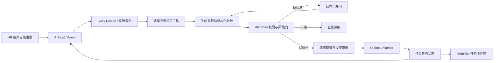

# GitHub / Product Hunt MCP 自然语言调用调研与 HRBPilot 路线决策

- 日期：2026-09-14
- 状态：**建议作为下一阶段决策依据**
- 范围：GitHub 开源实现、Product Hunt 产品案例、MCP 官方规范与工具设计方法
- 目标：让 HR / HR 经理通过自己的 AI Agent（WorkBuddy、Codex、Claude 等）用自然语言安全地调用 HRBPilot
- 取代：`2026-09-14-mcp-direction-research.md` 与 `2026-09-14-mcp-natural-language-invocation-research.md` 的路线结论；两者仅保留为背景材料

## 1. 结论先行

用户原始设想是可行的，但需要把产品定义从“授权后开放一组 MCP 工具”改成：

> **授权后，AI Agent 把自然语言编译成一份可审阅的 HR 任务草稿；HRBPilot 负责补齐信息、做权限与风险判断、进入审批和异步执行，并持续提供唯一可信的任务状态。**

最关键的研究结论有六条：

1. **MCP Server 通常不负责自然语言理解。** 用户的话先进入 WorkBuddy、Codex、Claude 等 Host；Host 中的模型根据工具名称、描述和 JSON Schema 选择工具并生成参数。Server 负责验证与执行。官方 Python SDK 对工具的定义也是“名称来自函数名、描述来自 docstring、参数来自类型提示”。[MCP Python SDK：Tools](https://github.com/modelcontextprotocol/python-sdk/blob/main/docs/servers/tools.md)
2. **OAuth 授权只是连接与身份，不等于任务已经可用。** 还必须同时满足：Host 愿意调用、工具在当前目录中可见、令牌 scope 足够、业务对象可访问、写操作通过确认/审批。HRBPilot 的真实客户端验收已经证明这几层会分别失败。
3. **“把所有功能都做成工具”不是成熟方向。** GitHub MCP Server 用 toolsets、单工具 allowlist、read-only 和 lockdown 缩小能力面；Strata、Composio 等在工具规模变大后改成渐进式搜索或少量 meta-tools。[GitHub MCP Server](https://github.com/github/github-mcp-server)；[Strata 机制](https://www.klavis.ai/blog/introducing-strata-one-mcp-server-for-thousands-of-tools)
4. **非技术用户需要的是“工作目标”，不是 API 动作。** n8n 把完整工作流暴露成工具；Anthropic 建议把经常连续调用的原子 API 合并成 `schedule_event` 这类任务工具。[n8n MCP Server](https://docs.n8n.io/connect/connect-to-n8n-mcp-server)；[Writing effective tools for agents](https://www.anthropic.com/engineering/writing-tools-for-agents)
5. **高风险动作必须在 Server 侧有不可绕过的治理。** `readOnlyHint`、`destructiveHint` 等注解只帮助 Host 展示风险，不能当权限边界；Server 仍需做 RBAC、对象权限、参数冻结、幂等、审批和审计。[MCP 工具规范](https://github.com/modelcontextprotocol/modelcontextprotocol/blob/main/docs/specification/2025-06-18/server/tools.mdx)
6. **HRBPilot 不需要先造另一个聊天产品。** 主入口可以继续是用户自己的 Agent；HRBPilot 应补“任务受理、审批卡片、任务收件箱、连接诊断”。项目内聊天只适合作为演示或没有外部 Agent 时的备用入口。

因此，建议保留现有 11 个细粒度工具作为内部能力与高级接口，但给普通 HR 用户默认只开放 5–7 个“任务型工具”，并增加一个持久任务投影。当前最值得做的不是新增更多业务动作，而是完成“自然语言 → 草稿 → 确认 → 审批 → 执行 → 状态回填”的闭环。

## 2. “自然语言调用 MCP”到底发生在哪里

典型链路如下：



这条链路里，MCP 主要标准化的是 `D → P → G → 结果` 的接口。聊天 UI、模型循环、会话记忆、审批 UX、长期任务和通知并不会因为“支持 MCP”自动出现。

### 成熟实现通常同时具备的组件

| 组件 | 解决的问题 | 常见实现 |
| --- | --- | --- |
| Agent Host | 理解自然语言、选择工具、多轮推理 | Codex、Claude、Goose、LangChain Agent、mcp-use Agent |
| 工具契约 | 告诉模型何时调用、如何填参 | `name + description + inputSchema + outputSchema` |
| Skill / Recipe | 稳定业务术语、顺序和禁区 | Goose recipe、Composio Skill、WorkBuddy Skill |
| 能力目录 | 避免模型一次看到太多工具 | toolsets、role bundle、tool search、meta-tools |
| 身份与授权 | 确定“谁能调用什么” | OAuth 2.1、per-user session、scope、RBAC |
| 业务治理 | 防止模型越权或直接产生副作用 | read-only 上限、审批、参数哈希、幂等、审计 |
| 任务编排 | 处理等待、重试、长任务和人工输入 | workflow engine、job ID、MCP Tasks 适配 |
| 可观测与评测 | 发现选错工具、参数错、循环与超时 | traces、execution log、golden utterances、held-out eval |

## 3. 典型案例

### 3.1 官方 MCP SDK：自然语言与执行的分界线

官方 SDK 的工具模型很直接：函数名成为工具名，docstring 成为模型可见描述，类型提示生成 JSON Schema，调用前自动校验参数。工具可以同时返回给模型阅读的 `content` 与给客户端使用的 `structuredContent`。这说明成熟 Server 的核心不是再运行一次通用自然语言模型，而是把确定性业务函数变成模型容易理解、客户端容易展示的契约。[Python SDK 工具文档](https://github.com/modelcontextprotocol/python-sdk/blob/main/docs/servers/tools.md)

可借鉴：

- 工具描述要写“什么时候用、什么时候不用”，不是只复述函数名。
- 固定值用 enum，标识符、时间、数量都用明确类型和边界。
- 人类摘要与机器结构分开返回。
- 工具注解只能提示 Host；Server 必须自己执行安全策略。
- 信息不足可用 Elicitation / multi-round-trip；长任务可用 Tasks，但 Tasks 在 `2025-11-25` 规范中仍标记为实验性，客户端支持不能假定一致。[Elicitation](https://modelcontextprotocol.io/specification/2025-06-18/client/elicitation)；[Tasks](https://modelcontextprotocol.io/specification/2025-11-25/basic/utilities/tasks)

### 3.2 LangChain MCP Adapters 与 mcp-use：Host 侧 Agent 循环

`langchain-mcp-adapters` 把一个或多个 MCP Server 的工具转换成 LangChain tools，再交给 `create_agent`。它支持多服务器、工具名前缀、调用拦截器、错误返回给模型后自纠错、运行时注入用户上下文等。默认每次工具调用新建会话，因此依赖隐式连接状态的工具会遇到问题。[LangChain MCP 文档](https://github.com/langchain-ai/docs/blob/main/src/oss/langchain/mcp.mdx)；[MultiServerMCPClient](https://github.com/langchain-ai/langchain-mcp-adapters/blob/main/langchain_mcp_adapters/client.py)

`mcp-use` 在此基础上提供 `MCPAgent`：模型接收自然语言，循环选择 MCP 工具，允许多步执行与流式输出。其 Product Hunt 定位又补上控制面、环境、访问配置、审计与可观测性，恰好说明“能跑 Agent 循环”和“能生产运营”是两件事。[mcp-use Python 实现](https://github.com/mcp-use/mcp-use/blob/main/libraries/python/README.md)；[Product Hunt：Manufact / mcp-use](https://www.producthunt.com/products/mcp-use)

可借鉴：

- HRBPilot 不必在 Server 内重复实现一个通用 Agent loop。
- 但不能把用户身份写进模型参数；应由 Host/网关的可信运行时注入。
- 工具错误要包含可执行的修正信息，帮助模型停止盲目重试。
- 需要对每次工具选择、参数、结果、耗时和错误做 trace。

### 3.3 GitHub MCP Server：能力分组与安全上限

GitHub 官方 Server 支持按 toolset、单个工具和排除列表配置能力。开启 read-only 后，即使显式请求某个写工具也不会暴露；lockdown 只过滤部分不可信公共内容，文档明确说明它不是授权边界。它还支持覆盖工具描述，适合做本地化和针对不同 Host 的措辞调优。[Server configuration](https://github.com/github/github-mcp-server/blob/main/docs/server-configuration.md)

可借鉴：

- HRBPilot 应提供按角色/场景的 bundles，而不是一个完整清单：`policy_qa`、`case_reader`、`case_coordinator`、`task_manager`。
- “只读”必须是 Server 侧上限，不由请求头或模型参数降低。
- 工具描述应版本化，可独立于业务实现优化并回归测试。
- 不可信制度文本、案件备注和外部材料进入模型后，只能作为数据，不能改变工具规则。

### 3.4 Supabase MCP：默认缩小项目、功能和写权限

Supabase MCP 提供 `project_ref`、`read_only=true` 和 `features=` 三层裁剪。项目范围开启后，账户级工具直接消失；只读模式使用只读数据库角色，并禁用其他变更类工具。官方还明确警告：开发者权限的 MCP Server 不应直接提供给客户终端用户，生产数据要慎用，客户端确认也不是万无一失。[Supabase MCP README](https://github.com/supabase-community/supabase-mcp/blob/main/README.md)

可借鉴：

- HRBPilot 的租户、用户、角色、scope 与客户端上限必须共同收窄工具面。
- 只隐藏按钮不够，执行层必须 fail closed。
- 外部模型读到的结果应是最小字段集，员工敏感字段默认不返回。
- 开发/测试连接和生产连接应使用不同凭据与端点。

### 3.5 Goose：Recipe 把 MCP 工具变成可复用工作方式

Goose 是开源 Agent Host。它通过 extensions 连接 stdio 或 Streamable HTTP MCP Server，并允许 recipe 只开放指定的 `available_tools`。Recipe 还能声明指令、初始提示、参数、输出结构和需要的扩展。换言之，MCP 提供“手”，Recipe 提供“这项工作应如何做”。[Goose Recipe Reference](https://github.com/aaif-goose/goose/blob/main/documentation/docs/guides/recipes/recipe-reference.md)；[Product Hunt：codename goose](https://www.producthunt.com/products/codename-goose)

可借鉴：

- WorkBuddy Skill 与 Codex Plugin/Skill 不应只是安装说明，而应包含 HR 任务路由、追问顺序、写操作语义和结果解释。
- 每个工作模板只加载需要的工具。
- Skill/Recipe 不能承载权限；即使被篡改，Server 仍应拒绝越权调用。

### 3.6 n8n：把完整业务工作流作为工具

n8n 有两种 MCP 形态：实例级 Server 可搜索、编辑和执行被开放的 workflows；MCP Server Trigger 可把单个 workflow 的工具暴露给外部客户端。`execute_workflow` 返回 execution ID，由 `get_execution` 查询结果，这比让模型自己拼几十个 API 步骤稳定。[n8n MCP Server tools](https://docs.n8n.io/connect/connect-to-n8n-mcp-server/mcp-server-tools-reference)；[MCP Server Trigger](https://docs.n8n.io/integrations/builtin/core-nodes/n8n-nodes-langchain.mcptrigger/)

它也暴露了真实的工程坑：

- 多 webhook replica 时，SSE/Streamable HTTP 需要把 MCP 请求路由到一个专用实例，否则连接会频繁失败。
- `execute_workflow` 对多步骤表单和 human-in-the-loop 交互不支持。
- 执行是异步的，必须把 execution ID、状态、错误和重试设计成产品的一部分。

可借鉴：对 HR 来说，“受理离职事项”“准备面谈纪要”“建立后续跟进”应该是一项任务工具，而不是让模型逐个调用底层 CRUD。

### 3.7 Strata：大工具目录的渐进式发现

Strata 不把上千个 schema 一次性交给模型，而是四步渐进发现：发现服务类别、列出类别动作、读取某个动作的完整 schema、执行动作。认证失败时再进入专门的 auth handler，而不是提前连接所有应用。[Strata 文档](https://docs.klavis.ai/documentation/concepts/strata)；[开源仓库](https://github.com/Klavis-AI/klavis)；[Product Hunt：Strata](https://www.producthunt.com/products/strata-2)

可借鉴：

- 当工具数增长时只在最后一步加载完整 schema。
- 先依据用户已连接、角色允许和场景相关性裁剪，再让模型搜索。
- 不要把“找工具”和“执行任意工具”做成一个无约束的 `execute_anything(prompt)`。

对 HRBPilot 的当前判断：只有 11 个工具，暂时没有必要照搬四层搜索；但默认给 HR 用户暴露 5–7 个任务型工具、给高级端点保留原子工具，已经可以获得大部分收益。

### 3.8 Composio：少量 meta-tools + Skill + 按需 OAuth

Composio 的开源插件只向 Agent 暴露少量 meta-tools，并用 Skill 教模型遵循 `search → connect → execute`。当真正需要某个应用时才返回 OAuth 链接，认证后继续原任务。其 session 可以绑定一个 user ID、固定 toolkits 和单个工具；如果工具很少，也可用 direct-tools preset，不必经过搜索。[Composio MCP Plugin](https://github.com/ComposioHQ/composio-mcp-plugin)；[MCP sessions](https://github.com/ComposioHQ/composio/blob/next/docs/content/docs/sessions-via-mcp.mdx)；[Product Hunt：Composio](https://www.producthunt.com/products/composio)

一个重要限制是：走托管 MCP endpoint 时，本地 SDK 的 `beforeExecute`、`afterExecute`、schema transform 等拦截器不会运行。这说明便携性与本地控制力之间存在真实取舍。

可借鉴：

- 一份核心业务 Skill，加两个薄客户端包；MCP 配置本身不会自动安装 Skill。
- 每个用户/安装实例单独建 session，连接凭据与任务审计绑定。
- 只有需要外部系统时才发起额外授权。
- HRBPilot 的最终治理必须留在自己的 Server/command gateway，不能只依赖客户端 hook。

### 3.9 Pipedream MCP Chat：完整聊天产品还需要哪些非 MCP 组件

Pipedream 的开源 MCP Chat 用 Vercel AI SDK 接模型和工具，Pipedream MCP 提供大量 API 与认证；应用另外使用 Auth.js 和 Postgres 保存用户与聊天历史。Product Hunt 页面把“内置认证管理 + 工具发现 + 跨应用自然语言任务”作为主要价值。[GitHub：Pipedream MCP Chat](https://github.com/PipedreamHQ/mcp-chat)；[Product Hunt：MCP Chat](https://www.producthunt.com/products/pipedream-chat)

可借鉴：

- 若 HRBPilot 以后内置聊天，登录、聊天历史、工具执行历史、失败恢复和数据保留都要单独设计。
- “一个聊天框”不是 MCP 自带能力，而是一整套 Host 产品。
- 跨应用能力不是 HRBPilot 当前差异化，暂不应投入连接器数量竞赛。

### 3.10 FastMCP：从工具服务器走向 Context Application

FastMCP 3/4 提供 provider、proxy、tool transform、middleware、细粒度授权、状态、后台任务、OpenTelemetry 和 Code Mode。Product Hunt 的“Context Application”定位很准确：生产问题不再只是注册函数，而是向不同用户动态提供正确的工具与上下文，并且可观察、可版本化。[FastMCP Server](https://github.com/PrefectHQ/fastmcp/blob/main/docs/servers/server.mdx)；[Product Hunt：FastMCP](https://www.producthunt.com/products/fastmcp)

可借鉴：

- 把工具目录当作按用户、角色、场景动态生成的视图。
- 用中间件统一做日志、限流、错误屏蔽和关联 ID。
- 工具 schema、描述和行为需要版本管理。
- 长任务实现可以参考标准 Tasks，但业务状态机必须先独立稳定。

## 4. 常见架构模式

| 模式 | 代表项目 | 优点 | 主要问题 | HRBPilot 适用性 |
| --- | --- | --- | --- | --- |
| 直连领域 Adapter | 官方示例、Supabase | 简单、可移植 | 工具多后选择质量下降；治理需自建 | 适合保留为底层 |
| Host Agent + MCP tools | LangChain、mcp-use、Goose | 自然语言和多步调用开箱可用 | 行为受模型和 Host 影响 | 外部 Agent 已承担此层 |
| Workflow-as-tool | n8n | 复杂流程确定、可恢复 | 灵活性低；流程需维护 | **非常适合核心 HR 任务** |
| Tool router / Gateway | Strata、Composio | 大目录、省上下文、集中认证 | 增加一层状态与供应商依赖 | 工具数增长后采用 |
| Context Application | FastMCP | 动态能力、UI、状态、治理、观测 | 架构复杂、客户端支持差异 | 中长期参考，不必整体迁移 |

### 开源实现可以复用的最小组合

HRBPilot 不需要引入一套新框架才能实现目标。现有 Python MCP Server 上补齐以下结构即可：

1. 用 Pydantic 模型定义任务草稿、缺失字段、确认结果和任务状态。
2. 用现有 `authorize_tool_call` 在发现和执行两侧做同一判定。
3. 新增任务门面工具，内部调用现有 service / approval / outbox，不复制业务逻辑。
4. 把 WorkBuddy Skill 和 Codex Skill 从同一份能力 manifest 生成或校验。
5. 用现有 PostgreSQL 保存 draft/task projection，用 Worker 处理异步执行。
6. 用轮询工具做兼容基线；客户端支持稳定后再映射到 MCP Tasks。

## 5. 反复出现的坑

### 5.1 连接成功被误认为业务成功

OAuth 成功只说明客户端拿到某种凭据。真实链路还会因为客户端工具审批、scope、role、对象 ACL、缺少 Skill 或写审批而失败。HRBPilot 当前 Codex/WorkBuddy 验收已经发生了这种错位。

**对策**：连接向导最后必须执行三项 smoke test：身份、一个业务只读工具、当前 scope 套餐；不能只显示“授权完成”。

### 5.2 工具太多或功能重叠

模型看到的每个 schema 都占上下文，名称相似时容易选错。GitHub 用 toolsets，Strata 和 Composio 用 progressive discovery/meta-tools，FastMCP 提供 search transform 与 Code Mode。

**对策**：普通 HR 端点只暴露少量任务工具；高级端点再提供原子工具；工具数量或 schema 体积达到评测阈值时再引入搜索，不预设一个行业通用数字。

### 5.3 机械地把 REST API 一对一包装成 MCP

这样把多步规划、ID 查找和错误恢复全部推给模型。Anthropic 的工程实践建议围绕高价值工作流合并工具，而不是复刻后端路由。[工具设计方法](https://www.anthropic.com/engineering/writing-tools-for-agents)

**对策**：以“用户要办什么”为边界，例如 `prepare_employee_followup`，内部可以完成搜索案件、解析人员、生成步骤和校验期限。

### 5.4 把客户端注解、确认框或 Skill 当权限

注解可能被 Host 忽略，Skill 可能没安装，确认框会因客户端不同而变化。

**对策**：权限、风险、冻结参数、审批、幂等和审计全部留在 HRBPilot Server；客户端层只改善体验。

### 5.5 提示注入从工具结果跨到写工具

案件描述、制度附件、邮件或网页都是不可信内容。GitHub lockdown 也明确只是 best-effort 过滤，不是安全边界。[GitHub MCP Server：Lockdown](https://github.com/github/github-mcp-server#lockdown-mode)

**对策**：

- 所有读取结果带来源与信任等级；
- 非可信文本不能直接决定收件人、金额、身份、审批人或执行目标；
- 写工具只接受从可信查找器选出的 ID 或用户明确确认的值；
- 高风险字段在确认卡片中独立显示。

### 5.6 OAuth token passthrough 与 confused deputy

MCP 安全指南明确禁止把客户端给 Server 的令牌不经正确 audience 验证后直接转发给下游 API；这会破坏授权边界和审计。[MCP Security Best Practices](https://github.com/modelcontextprotocol/modelcontextprotocol/blob/main/docs/docs/2026-07-28/tutorials/security/security_best_practices.mdx)

**对策**：HRBPilot access token 只用于访问 HRBPilot；连接第三方系统时由 HRBPilot 作为独立 OAuth client 获得专用凭据，或使用明确的 token exchange/delegation 设计。

### 5.7 长任务、人工等待与重试被当成一次工具调用

审批可能耗时数小时甚至数天，HTTP 会断开，Agent 也可能换客户端。n8n 返回 execution ID；MCP Tasks 使用 task ID、状态和延迟取结果。

**对策**：任何写任务先持久化，再返回 task ID；每次重试带 idempotency key；任务状态与连接、聊天会话解耦。

### 5.8 传输与客户端兼容差异

n8n 文档记录了多副本下 SSE/Streamable HTTP 的粘性路由问题；不同 Host 对 OAuth、Elicitation、Tasks、prompts、resources、Apps 和注解的支持也不一致。

**对策**：定义“最小兼容协议”：HTTP + OAuth + tools + 轮询 task tools；增强能力按客户端协商启用，并维护真实客户端版本矩阵。

### 5.9 没有可观测与评测，只能靠感觉判断“能用了”

Anthropic 建议用真实任务建立 prompt-response 评测，记录工具选择、错误、调用数、耗时和 token，并用 held-out 测试集防止只优化演示话术。[Agent tool eval 方法](https://www.anthropic.com/engineering/writing-tools-for-agents)

**对策**：先建立中文 HR 口语黄金集，再改工具描述和 schema。每次发布同时跑模拟模型评测与 WorkBuddy/Codex 真实客户端 smoke test。

## 6. 比原始设想更优的方案：Intent-to-Task Gateway

### 6.1 产品结构

不做“一个端点暴露所有功能”，改为三层：

| 使用者 | 默认入口 | 暴露内容 |
| --- | --- | --- |
| HR / HR 经理 | 自己的 WorkBuddy/Codex + HRBPilot Skill | 5–7 个任务型工具、少量只读工具 |
| 高级用户 / 集成开发者 | 完整 MCP endpoint | 经 scope 与 bundle 裁剪的原子工具 |
| 管理员 / 审批人 | HRBPilot Web | 连接诊断、任务收件箱、审批、审计与撤销 |

### 6.2 建议的外部工具面

首版建议如下，不使用危险的 `execute_anything(prompt)`：

| 工具 | 作用 | 副作用 |
| --- | --- | --- |
| `get_my_access_profile` | 查看身份、能力、缺失 scope、连接状态 | 无 |
| `answer_policy_question` | 完成检索、选取原文与出处并返回可引用答案 | 无 |
| `get_case_context` | 按自然语言/案件号解析对象并返回最小完整上下文 | 无 |
| `prepare_hr_action` | 把目标编译成冻结草稿；返回候选对象、缺失字段、步骤、风险和所需权限 | **无** |
| `submit_hr_action` | 提交指定 draft；只进入现有审批/队列，不直接执行业务写入 | 创建审批/任务 |
| `get_task_status` | 查询唯一真实状态、阻塞点、下一动作和链接 | 无 |
| `list_my_tasks` | 回答“我刚才交代的事情”“有哪些待处理” | 无 |
| `provide_task_input` / `cancel_task` | 补齐字段或取消尚未执行的任务 | 受状态机约束 |

原有 `search_policy`、`search_cases`、`assign_case_owner` 等继续保留，但普通 HR bundle 默认不全部展示。任务型工具内部复用它们的 service，不通过 MCP 自我调用。

### 6.3 `prepare_hr_action` 应返回什么

```json
{
  "draft_id": "draft_...",
  "status": "input_required | ready_for_confirmation | blocked",
  "interpreted_goal": "为王五建立入职材料补齐跟进",
  "subject_candidates": [],
  "missing_fields": [],
  "planned_steps": [],
  "risk": {
    "level": "low | medium | high",
    "reasons": []
  },
  "required_scopes": [],
  "expires_at": "...",
  "confirmation_summary": "..."
}
```

关键约束：

- draft 在 Server 侧保存，并冻结 canonical parameters 与 hash；不能让客户端在确认后偷偷改参数。
- 模型只能建议 subject candidates，最终 ID 必须通过有权限的服务端解析。
- `confirmation_summary` 使用人类可读姓名、案件号、截止时间和动作；内部 UUID 不作为主要交互文本。
- 高风险事项可以返回 evidence-only / handoff，不生成可执行审批。

### 6.4 对外任务状态

不要立刻合并现有 `work_tasks`、`async_tasks`、`approval_requests` 和执行记录；先做统一投影：

```text
draft
  -> input_required
  -> ready_for_confirmation
  -> awaiting_approval
  -> queued
  -> running
  -> completed | failed | cancelled | expired
```

统一返回：`task_id`、`status`、`status_message`、`next_actions`、`poll_after_ms`、`links`、`last_updated_at`。task ID 只是资源标识，每次读取仍按 `(tenant, user/role, task_id)` 校验，不能把不可猜测 ID 当权限。

### 6.5 确认与审批不是一回事

- **确认**：用户确认系统理解的目标和参数是否正确。
- **审批**：HRBPilot 根据组织制度决定该动作是否允许执行。

只读操作无需确认；中风险写操作一次确认后进入单人审批；高风险或不可逆操作应加强审批或仅转人工。不能因为 Host 已弹过工具确认，就跳过 HRBPilot 的业务审批。

### 6.6 为什么不建议先做内置聊天

Pipedream MCP Chat 的开源结构表明，内置聊天还需要模型选择、消息持久化、用户登录、会话数据保留、流式 UI 和错误恢复。它会显著扩大产品面，却不会修复 HRBPilot 当前缺失的任务闭环。

更合适的 Web 产品是：

- 连接诊断：当前客户端、最后成功调用、scope 与重授权入口；
- 任务收件箱：等待补充、待确认、待审批、执行中、失败、完成；
- 审批卡片：展示冻结参数、风险原因、依据与预期副作用；
- 审计详情：谁通过哪个客户端提出、谁审批、实际执行了什么。

## 7. 对现有计划的修改建议

### 保留

- OAuth 2.1/PKCE、租户隔离与现有 MCP HTTP 服务。
- `authorize_tool_call` 作为角色能力、scope、客户端上限的唯一判定。
- 所有写操作进入审批，审批与调用审计同事务。
- Outbox / Worker、审批消费与重复执行保护。
- WorkBuddy Skill 中“制度有来源、写入只表示已提交审批”的规则。

### 调整

1. 把原计划的泛化 `prepare_hr_task` 改为 **`prepare_hr_action` + 类型化 task templates**；它只能产出草稿，不能接受任意 prompt 后直接执行。
2. 把“跨客户端一致性”提前到 P0：先维护同一份 capability manifest，再生成/校验 WorkBuddy 与 Codex 包。
3. 把评测提前到新增工具之前：没有路由与参数基线，无法知道改动是否更好。
4. 将 annotations、output schema、错误修复提示和工具描述版本化列为 P0，不再视为文档润色。
5. 将标准 MCP Tasks 延后为适配层；首版依靠 HRBPilot 自己的 task tools 保证所有 Host 都能用。
6. 将“项目内聊天窗口”从主路线降为可选；优先做任务收件箱和审批 UI。

### 暂不做

- 不做 `execute_anything(prompt)` 或让 Server 内第二个通用 LLM 直接执行。
- 不为了“所有功能”继续一对一包装 REST API。
- 不在 11 个工具规模下引入复杂 Code Mode 或四层通用工具搜索。
- 不做 A2A；当前问题是 Agent 到业务工具与任务，不是 Agent 之间委托。
- 不引入第三方大连接器平台作为 HRBPilot 核心依赖；需要 Gmail/Calendar 等外部能力时再按场景评估。

## 8. 推荐实施顺序

### P0：先证明链路与建立基线（2–4 天）

- 修复 Codex scope 套餐与 WorkBuddy `Needs authentication`，完成真实两端只读调用。
- 连接完成页自动校验身份、effective scopes 和一个业务工具。
- 为 11 个工具补准确 annotations、output schema、可纠错错误和版本化中文描述。
- 建立 50–100 条中文 HR 口语黄金集：正确工具、必要参数、应拒绝/应补问、最终状态。
- 修正网页与连接包中已漂移的能力说明。

完成门槛：两端“授权 → 查制度”成功；Codex 完成一次“创建审批 → 查真实状态”；未经批准的写入为 0。

### P1：Intent-to-Task MVP（1–2 周）

- 新建 server-side draft 与 task projection。
- 实现 `prepare_hr_action`、`submit_hr_action`、`get_task_status`、`list_my_tasks`、`provide_task_input`、`cancel_task`。
- 先支持三个高频任务模板：员工事项跟进、案件状态变更建议、制度问题答复。
- 所有写入复用现有审批、幂等、Outbox、Worker 与审计。
- 不支持 Elicitation 的客户端统一回退到 `input_required + missing_fields`。

完成门槛：用户用一句中文提出任务，最多一次必要补问和一次确认，获得可跨客户端查询的 task ID；重试不产生重复审批或重复写入。

### P2：角色化交付与治理面（1 周）

- 建立单一 capability manifest，定义 bundles、scope、风险、示例和客户端兼容信息。
- 发布 WorkBuddy Connector + Skill 与 Codex Plugin/Skill；两个包不复制权限规则。
- Web 增加连接诊断、任务收件箱和审批卡片。
- 管理员可配置每个角色/客户端的 bundle 上限，并查看调用与任务 trace。

完成门槛：同一批 held-out 话术在 WorkBuddy/Codex 中路由或正确补问率 ≥90%，状态一致率 100%。

### P3：扩展场景并做真实 HR 灰度（2–4 周）

- 根据真实失败数据增加任务模板，而不是根据后端 API 数量增加工具。
- 度量首次成功率、补问次数、错误恢复率、审批转化、完成时长、重复副作用和误拒绝。
- 当默认工具面在评测中出现明显选择退化时，再引入 capability search / progressive discovery。

### P4：标准协议增强（按客户端支持触发）

- 将内部 task projection 适配 MCP Tasks；保留轮询工具兼容层。
- 评估 MCP Apps/交互 UI，用于审批卡片和结构化补参。
- 企业客户出现集中 SSO 需求时，再评估 Enterprise-Managed Authorization。

## 9. 建议现在批准的决策

建议批准 **P0 + P1**，并把成功定义为“一个真实 HR 目标能形成安全、可追踪、跨客户端一致的任务”，而不是“新增了多少 MCP 工具”。

优先场景建议选：

> “帮王五安排补齐入职材料，下周三前完成；如果已有相关案件就关联，没有就告诉我需要补什么。”

它能同时验证：自然语言意图、人员/案件解析、缺失信息补问、日期、任务草稿、用户确认、审批、异步状态和跨客户端回查。若这条链路稳定，原始设想才算真正成熟。

## 10. 项目内证据

- MCP 工具与写入只创建审批：`app/mcp/server.py:153-416`
- 唯一授权判定：`app/mcp/auth/authorization.py:141-206`
- 工具 catalog、scope、风险、幂等元数据：`app/scenarios/hr_case_agent/tools.py:98-169`
- WorkBuddy 业务 Skill：`connectors/workbuddy/skills/hrbpilot/SKILL.md:1-75`
- 真实客户端验收与原路线：`docs/plans/2026-09-14-natural-language-mcp-task-roadmap.md`

## 11. 来源与证据边界

### 一手技术来源

- [MCP Architecture](https://modelcontextprotocol.io/specification/2025-06-18/architecture)
- [MCP Python SDK：Tools](https://github.com/modelcontextprotocol/python-sdk/blob/main/docs/servers/tools.md)
- [MCP Elicitation](https://modelcontextprotocol.io/specification/2025-06-18/client/elicitation)
- [MCP Tasks](https://modelcontextprotocol.io/specification/2025-11-25/basic/utilities/tasks)
- [MCP Security Best Practices](https://github.com/modelcontextprotocol/modelcontextprotocol/blob/main/docs/docs/2026-07-28/tutorials/security/security_best_practices.mdx)
- [GitHub MCP Server](https://github.com/github/github-mcp-server)
- [Supabase MCP](https://github.com/supabase-community/supabase-mcp)
- [LangChain MCP Adapters](https://github.com/langchain-ai/langchain-mcp-adapters)
- [mcp-use](https://github.com/mcp-use/mcp-use)
- [Goose](https://github.com/aaif-goose/goose)
- [n8n MCP documentation](https://docs.n8n.io/connect/connect-to-n8n-mcp-server)
- [Klavis / Strata](https://github.com/Klavis-AI/klavis)
- [Composio MCP Plugin](https://github.com/ComposioHQ/composio-mcp-plugin)
- [Pipedream MCP Chat](https://github.com/PipedreamHQ/mcp-chat)
- [FastMCP](https://github.com/PrefectHQ/fastmcp)
- [Anthropic：Writing effective tools for agents](https://www.anthropic.com/engineering/writing-tools-for-agents)

### Product Hunt 案例页

- [Manufact / mcp-use](https://www.producthunt.com/products/mcp-use)
- [Pipedream MCP](https://www.producthunt.com/products/pipedream)
- [Pipedream MCP Chat](https://www.producthunt.com/products/pipedream-chat)
- [Composio](https://www.producthunt.com/products/composio)
- [Strata](https://www.producthunt.com/products/strata-2)
- [FastMCP](https://www.producthunt.com/products/fastmcp)
- [n8n](https://www.producthunt.com/products/n8n-io)
- [codename goose](https://www.producthunt.com/products/codename-goose)

Product Hunt 页面用于判断产品定位、安装方式和用户感知问题；其中用户数、准确率、节省 token 等厂商自述未作为本报告的关键架构结论。未在本轮逐个安装和运行第三方项目，代码行为结论以仓库与官方文档为依据；HRBPilot 自身状态则以本仓库代码和先前真实客户端验收为依据。
