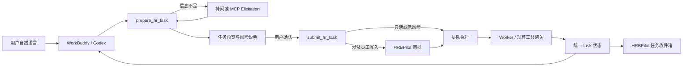

# HRBPilot 外部 AI 助手任务入口研究与路线建议

## 结论

HRBPilot 当前已经完成了“安全的远程 MCP 工具服务”，但还没有完成“自然语言任务入口产品”。两者不是同一件事：OAuth 授权解决的是“谁可以调用哪些能力”，MCP 工具解决的是“客户端能调用哪些函数”；用户期待的“说一句话，HRBPilot 就受理、补全、确认、排队、执行并持续回报”还需要一个独立的任务受理与生命周期层。

因此，后续不应继续把主要精力放在 OAuth 协议细节上，也不应另造一个与 WorkBuddy、Codex 重复的聊天界面。建议把下一阶段的产品中心改为：

> **WorkBuddy / Codex 负责对话和初步工具选择；HRBPilot 负责把意图规范化为可审计任务、补齐缺失信息、提交审批、异步执行，并提供唯一可信的任务状态。**

这条路线保留现有安全边界，也最接近原始产品设想。

## 现状判断

### 已经成熟的部分

1. MCP Streamable HTTP、OAuth 2.1/PKCE、动态客户端注册、资源绑定令牌、刷新与撤销已经具备完整服务端实现和标准客户端端到端测试。
2. 工具执行前会重新校验角色、scope、客户端授权上限和对象权限；写操作不会直接执行，而是进入审批、Outbox 和 Worker。
3. 已经有制度检索、案件查询、审批查询和五个建议型写工具，其中包括 `create_work_task`。
4. 管理端已经可以查看并撤销客户端与授权实例，安全控制面不是空白。

这些基础设施是正确的，不建议推倒重做。

### 本轮真实客户端验收

本机环境与服务均处于可测试状态：HRBPilot 的 app、OAuth AS、PostgreSQL、Redis、Worker、Web 等 Compose 服务正在运行；Codex CLI 为 `0.154.0`，WorkBuddy 桌面端为 `5.5.6`。

| 验收项 | 真实结果 | 含义 |
| --- | --- | --- |
| Codex MCP 注册 | `hrbpilot-local` 已注册，状态为 OAuth | 传输与发现已工作 |
| Codex 自然语言选工具 | 输入“告诉我当前 HRBPilot 连接身份能使用哪些能力”后，Codex 自动选择了 `get_my_access_profile` | 自然语言到工具选择本身已经成立 |
| Codex 第一层调用 | 当 Codex 工具审批策略为 `never` 时，调用被客户端侧拒绝 | OAuth 授权不等于 Codex 的工具调用确认 |
| Codex 放行后的调用 | 调用成功，身份为 `hrbp/default` | OAuth 凭据、MCP 请求与结果解析均可工作 |
| Codex 当前 scope | 只有 `hrb:profile:read`；11 个工具中仅 1 个可用，另 10 个不可用 | 当前授权不足以查制度、看案件或创建任务 |
| WorkBuddy MCP 状态 | 项目级 `hrbpilot-local` 已识别，但 CLI 返回 `Needs authentication` | WorkBuddy 的 OAuth 回调/凭据闭环尚未完成 |

所以“点过授权后仍不能直接下任务”不是错觉，也不是一个单点故障，而是三个层次叠加：

1. **当前接入状态未完成**：Codex scope 过窄，WorkBuddy 仍未认证完成。
2. **客户端还有自己的调用确认**：MCP 规范要求用户对工具调用保有控制，客户端可以在 OAuth 之外再次询问是否允许调用。
3. **服务端缺少通用任务受理层**：即使授权补齐，现有 `create_work_task` 仍要求调用者先提供一个已有 `case_id`，且只会创建待审批记录；它不是“把任意自然语言交给 HRBPilot 继续处理”的入口。

## 缺失环节

### 1. 授权完成页没有证明“业务能力可用”

当前接入脚本在 `mcp login` 返回后就显示“连接完成”，随后只建议调用权限摘要。它没有检查最终 scope，也没有跑一个业务只读工具。因此“授权成功”实际只证明拿到了令牌，不能证明拿到了用户想要的能力。

应把完成条件改成：

- 身份查询成功；
- 预期 scope 与实际 effective scopes 一致；
- 至少一个业务只读工具成功；
- 如果用户选择“办理任务”，`hrb:case:propose` 和 `hrb:approval:read` 同时存在。

### 2. WorkBuddy 现在只有 MCP 配置，没有完整 Connector + Skill 体验

仓库根目录的 `.mcp.json` 能让 WorkBuddy 发现服务器，但仓库中的 `connectors/workbuddy/` 仍是待发布包：MCP URL 和图标是占位内容，而且包内 Skill 并未因为项目级 `.mcp.json` 自动变成已安装连接器能力。

WorkBuddy 官方把 MCP + Skill 作为 API 服务的推荐方式：MCP 提供结构化工具，Skill 负责告诉模型何时使用、怎样补参、怎样解释审批和失败。当前仅完成了前半段，所以自然语言体验会随模型和上下文漂移。

### 3. Codex 缺少与 WorkBuddy Skill 对等的产品包

Codex 已能发现工具，但目前只有一个全局 MCP URL 配置，没有 HRBPilot 专属 Skill/插件来稳定说明以下业务语义：

- 用户说“帮我跟进”时，应先找案件还是先起草任务；
- 找不到案件时应怎样补问；
- 写工具的成功只代表“已提交审批”，不能说“已完成”；
- 用户追问“办好了吗”时应自动查询真实状态；
- 哪些请求必须拒绝或转人工。

因此需要维护“一份核心业务指令、两个薄客户端包”：WorkBuddy Connector + Skill，以及 Codex Plugin/Skill。两者引用同一组工具契约和验收用例，不复制权限逻辑。

### 4. 工具粒度覆盖业务动作，却没有覆盖“受理一个目标”

现有工具是底层动作：查制度、找案件、读案件、改负责人、发通知、创建跟进任务。用户自然表达通常更上层，例如：

- “王五试用期材料还没齐，帮我安排后续跟进。”
- “把最近三条高风险离职案件整理一下，需要处理的建成任务。”
- “上次那件事继续推进，有结果告诉我。”

这些话包含目标、上下文解析、对象选择、缺失字段补问、风险判断、计划预览和状态订阅。把它们完全交给不同客户端的模型临时拼接，会造成跨客户端不一致。

建议新增一个服务端受理门面，但不要做危险的 `execute_anything(prompt)`：

1. `prepare_hr_task(goal, context_refs?)`：只做解析和预览，返回规范化目标、候选对象、缺失字段、风险、建议步骤和所需授权，不产生业务副作用。
2. `submit_hr_task(draft_id, confirmation)`：提交已冻结的草稿；需要写入时进入现有审批链。
3. `get_task_status(task_id)`：返回唯一真实状态、当前阻塞点、下一动作和结果链接。
4. `list_my_tasks(status?, limit?)`：支持“我刚才交代的事情有哪些”。
5. `cancel_task(task_id)` / `provide_task_input(task_id, fields)`：允许取消或补齐信息。

现有细粒度工具继续保留，供高级客户端直接调用；新门面只负责跨工具编排和稳定体验。

### 5. 三套内部状态没有统一成外部任务状态

项目已有 `work_tasks`、`async_tasks`、`approval_requests`、Agent run 和 Outbox execution，但外部客户端没有一个统一 task handle。结果是用户必须理解“案件编号、审批编号、异步任务编号”分别是什么，客户端也无法用一个 ID 连续追踪。

建议增加外部任务投影视图，而不是立刻合并所有内部表：

```text
draft
  → input_required
  → ready_for_confirmation
  → awaiting_approval
  → queued
  → running
  → completed | failed | cancelled
```

对外统一返回：`task_id`、`status`、`status_message`、`next_actions`、`poll_after_ms`、`links`。内部仍可分别使用审批、Outbox、Celery 和工作任务表，通过关联表或投影服务映射。

### 6. 长任务协议应该兼容，不应该成为首发依赖

MCP 的 Tasks 能表达持久状态、轮询、取消和延迟取结果，方向与 HRBPilot 很匹配；但 `2025-11-25` 版本仍标记为实验性，2026 年的协议候选又把 Tasks 从核心移到扩展并调整了接口。本机 Codex 的 `mcp_2026_07_28` 特性也尚未启用。

因此首版应以 HRBPilot 自己的 `task_id + get/list/cancel` 工具为稳定兼容层；客户端与 SDK明确支持新版 Tasks 扩展后，再把同一个内部任务投影适配成标准 Tasks。这样不会因为协议版本变化重做业务状态机。

### 7. 工具元数据与内部页面仍有陈旧信息

当前 MCP 工具没有使用 SDK 已支持的 `ToolAnnotations`，也没有对外声明准确的结构化输出模式。补上 `readOnlyHint`、`destructiveHint`、`idempotentHint`、`openWorldHint` 和真实 output schema，能帮助客户端更准确地展示风险、生成参数和解释结果，但不能作为权限边界。

内部 MCP 页面还有两处明显漂移：仍展示已经移除的 `hrbpilot_ping`，并写着“查询类允许匿名试用”，而当前服务端业务读取实际要求登录。这会让用户和验收人员误判系统行为，应在下一轮一起修正。

## 目标体验



用户侧应看到的是：

1. 第一次连接时清楚选择“只查询”或“查询 + 提交办理建议”。
2. 输入自然语言后，系统先展示它理解成了什么；缺信息只问必要字段。
3. 涉及写入时明确显示“将提交审批”，而不是重复弹出含义不明的授权。
4. 提交后得到一个任务编号；以后无论从 WorkBuddy、Codex 还是 HRBPilot 网页查询，状态一致。
5. 完成、失败、需要补充信息时有可见通知；客户端不在线时，HRBPilot 任务收件箱仍是事实来源。

## 建议路线

### P0：把现有链路真正打通（1–2 天）

目标不是增加功能，而是让现在承诺的能力可用。

- Codex 重新授权明确的 scope 套餐：
  - 查询版：`hrb:profile:read`、`hrb:policy:read`、`hrb:case:read`、`hrb:approval:read`；
  - 办理版：查询版再加 `hrb:case:propose`。
- 接入脚本显式请求 scope，并在结束时自动校验 effective scopes；旧的窄 scope 凭据应提示重新授权。
- 在 WorkBuddy 桌面端重新完成认证，直到 CLI 不再显示 `Needs authentication`；然后用真实自然语言调用权限查询和制度检索。
- 安装/加载 WorkBuddy Skill，而不是只保留项目级 `.mcp.json`。
- 为所有工具补充 annotations 和准确 output schema。
- 修正 MCP 页面里的匿名读取与已移除 ping 文案。
- 用两端共同的五条黄金话术验收：查身份、查制度、找案件、创建跟进任务、追问任务状态。

P0 完成标准：Codex 与 WorkBuddy 至少都能从自然语言完成“查制度”；Codex 再完成一次“提交跟进任务审批 → 查询审批状态”。

### P1：任务受理 MVP（3–5 天）

- 新增 `task_intakes` 或等价草稿模型，保存规范化目标、创建者、客户端、上下文引用、风险、冻结参数哈希和过期时间。
- 实现 `prepare_hr_task`、`submit_hr_task`、`get_task_status`、`list_my_tasks`。
- 支持没有现成 `case_id` 的普通跟进任务；若动作必须绑定案件，返回候选案件或要求用户确认创建/选择案件。
- 对支持 Elicitation 的客户端进行结构化补参；对不支持的客户端返回 `input_required + missing_fields`，由模型继续提问。
- 复用现有审批、幂等、Outbox、Worker 与审计，不建立第二条写入通道。

P1 完成标准：用户可以只说“帮王五安排补齐入职材料，下周三前完成”，系统最多经过一次必要补问和一次确认，产生可追踪任务；任何写入都没有绕过审批。

### P2：跨客户端一致性与控制面（1–2 周）

- 发布可安装的 WorkBuddy Connector + Skill；补正式 URL、图标、版本和提审材料。
- 提供 Codex Plugin/Skill 包，引用同一业务指令与测试语料。
- HRBPilot 网页新增“连接诊断”：显示客户端、最后成功调用、授权范围、缺失范围、重新授权入口和一键只读测试。
- 新增统一“任务收件箱”：草稿、待补充、待审批、运行中、失败、已完成。
- 建立跨客户端回归集，记录真实版本，不用 SDK 成功替代真实客户端成功。

P2 完成标准：同一批 30 条自然语言任务在 WorkBuddy 与 Codex 中，工具/意图路由一致率不低于 90%；结果状态逐项一致；不存在“客户端说完成、系统仍待审批”的情况。

### P3：标准 Tasks 适配与生产灰度（2–4 周，按客户端支持度启动）

- 在内部 task 投影稳定后，适配 MCP Tasks 扩展；不改变业务 task ID 和状态来源。
- 支持取消、进度、`input_required`、延迟取结果和状态通知；保留轮询工具作为兼容回退。
- 增加任务级限流、并发上限、TTL、异常轮询检测和跨租户负例。
- 以一个真实 HR 团队做灰度，收集任务受理成功率、补问次数、审批转化率、完成时长和失败恢复率。

## 验收指标

| 指标 | 首期目标 |
| --- | --- |
| 授权后首次业务只读成功率 | ≥ 95% |
| 自然语言正确路由或明确补问率 | ≥ 90% |
| 无必要重复补问 | 每任务不超过 1 次 |
| 未经审批产生员工相关写入 | 0 |
| 重试导致重复任务/重复审批 | 0 |
| 客户端与 HRBPilot 状态不一致 | 0 |
| 失败结果有可执行下一步 | 100% |
| WorkBuddy/Codex 真实版本回归 | 每次发布各至少 1 轮 |

## 现在应该做的决定

建议立刻批准 P0 + P1，不继续扩展更多底层 HR 动作，也暂不投入 MCP Tasks 协议适配。当前最有价值的不是再多五个工具，而是让用户的一句话能稳定进入一个可确认、可审批、可追踪的任务闭环。

P0 可以马上证明现有投资是否形成真实使用体验；P1 则补上原始产品设想中真正缺失的那一层。P2/P3 应以 P1 的真实任务数据和客户端兼容结果作为进入条件。

## 项目内证据

- 工具定义与现有任务约束：`app/mcp/server.py:153-416`
- OAuth scope 词表：`app/access/scopes.py:27-51`
- Codex 本机接入脚本：`scripts/connect-codex-local-mcp.sh:28-57`
- WorkBuddy 待发布包状态：`connectors/workbuddy/README.md:1-23`
- WorkBuddy 业务指令：`connectors/workbuddy/skills/hrbpilot/SKILL.md:1-75`
- 既有真实客户端兼容矩阵：`docs/ops/2026-09-14-client-compatibility-matrix.md:1-106`
- 内部 MCP 页面陈旧文案：`web/src/features/mcp/McpPage.tsx:29-40`、`web/src/features/mcp/McpPage.tsx:117-145`

## Sources

1. WorkBuddy, “[连接器](https://open.workbuddy.cn/docs/connector),” accessed 2026-09-14. MCP + Skill is the recommended integration for API-backed services and enables natural-language invocation after connector installation.
2. Model Context Protocol, “[Tools](https://modelcontextprotocol.io/specification/draft/server/tools),” draft specification. Tools are model-controlled, schema-described capabilities; hosts should keep users able to review or deny calls.
3. Model Context Protocol, “[Elicitation](https://modelcontextprotocol.io/specification/2025-11-25/client/elicitation),” 2025-11-25. Defines in-band forms and URL-mode interaction for information required during a tool workflow.
4. Model Context Protocol, “[Tasks](https://modelcontextprotocol.io/specification/2025-11-25/basic/utilities/tasks),” 2025-11-25. Defines durable status, polling, cancellation and deferred result retrieval, while marking the feature experimental.
5. Model Context Protocol, “[The 2026-07-28 MCP Specification Release Candidate](https://blog.modelcontextprotocol.io/posts/2026-07-28-release-candidate/),” 2026-07-28. Moves the production-informed redesign of Tasks from the core protocol into an extension.
6. OpenAI, “[Codex app-server README](https://github.com/openai/codex/blob/main/codex-rs/app-server/README.md),” accessed 2026-09-14. Documents MCP server startup/authentication state and reauthentication signaling in Codex.
7. OpenAI, “[OpenAI Developers](https://developers.openai.com/),” accessed 2026-09-14. Describes plugins as a package of skills, MCP servers and optional UI for ChatGPT and Codex.
